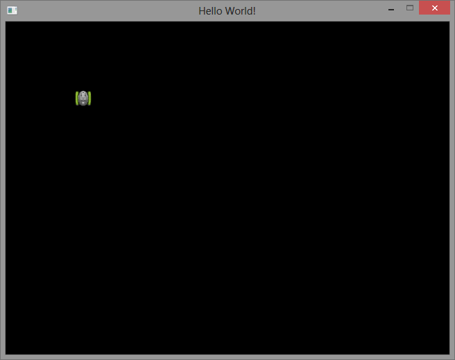

Game Engines 1 Labs
===================

Lab 1
-----
### Part 1
In this weeks lab you will be installing some of the prerequisites required to run the BGE code in the lab. 

Firstly you will have to clone the source code for this weeks lab from the git hub repo...

Start a git bash shell, create a new folder on your U drive or a USB stick and navigate to it.

Type the following EXACTLY:

git clone https://github.com/skooter500/sdl-sprites-lab

This will fetch the required files, including the visual studio project file from the github repository. If you navigate to the folder and open up the Visual Studio Solution and hit F5, you will see that the project will not compile. This is because you are missing two required open source libraries to run the project. These are:

GLM - Maths Library

SDL - Simple Direct Media Library. This is a really cool open source game development library that provides cross platform access to hardware such as screen buffers, the keyboard & mouse, audio etc. Its used in lots of commercial games such as Valve's Team Fortress 2

Firstly go to [http://glm.g-truc.net/0.9.5/index.html]() and download and install the GLM libraries. This is a header file only library. To set this up in your project, navigate to:

Project | Properties | VC++ Directories | Include Directories - And enter the path to the include directory for the GLM libraries you just downloaded

Make sure you select the project in the project explorer first!

Now go to  [http://www.libsdl.org/download-2.0.php]() and download the appropriate Development Libraries for your platform (Windows or Mac)

Go to: 

Project | Properties | VC++ Directories | Include Directories - And enter the path to the include folder in SDL

Go to:

Project | Properties | VC++ Directories | Libary Directories -  And enter the path to the lib\x86 folder in SDL

There are similar settings for Xcode/Eclipse for those on the mac.

You might find it easier to navigate to the folder in Explorer and copy the paths out of the address bar.

Now go to:

Project | Properties |  Linker | Input | Additional Dependancies

And ADD SDL2main.lib;SDL2.lib;

If you have followed the above steps EXACTLY your program should now build

BUT Guess What! It wont run. Visual Studio will complain about a missing SDL DLL. 

There are several ways to solve this problem, but the easiest is to add the path to the sdl dll files to the Project | Properties | Debugging | Environment setting:


If all the above works you should get a screen like this:



Congratulations! 

If you didnt get a screen like this, go back and make sure you have followed the steps correctly. 

Now spend some time to understand the code. The main classes are:

GameComponent - Everything in the game will extend this.

Game - Extends GameComponent and keeps an stl::list of GameComponent's (like a List in C# or an ArrayList in Java)

Player - Extends GameComponent and manages the player sprite

You should realise that the code is not much different to what we wrte in the class last week, just with rendering added.

Some things to try:

Try and figure out how to get the player tank to rotate in response to the left and right arrow keys. You might remember how to do this from second year Allegro :-) You can use the following:

```C++
glm::sin(theta);
glm::cos(theta);
```

To calculate the look vector based on the value of rotation. These functions accept parameters in RADIANS. Keep in mind that the rotation parameter to the function:
```C++
SDL_RenderCopyEx
```
Needs to be in DEGREES

You can use the function:
```C++
glm::degrees
```
To convert from radians to degrees

Try and create a Bullet class (another subclass of GameComponent) and get the player to fire bullets when the space key is pressed

Try and figure out how to adjust the fire rate so that the tank can only fire 10 bullets per second (hint - use the time delta)

Try and get the bullets to be removed from the scene when they go outside the bounds of the screen.

###Part 2
Try and get BGE to compile. You can clone it by typing:

git clone https://github.com/skooter500/BGE

You need to download the Dependencies from here: [http://1drv.ms/1olPefQ]() And unzip to the Dependancies folder in your Solution. Your folder structure should look like this:


I am curious to see if this works without installing the Kinect/Leap SDK's and drivers.
